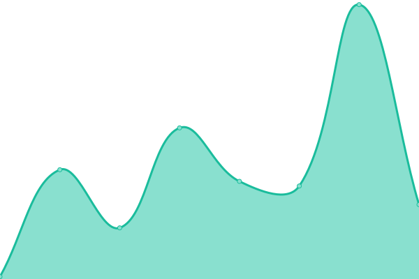

# [📈 Live Status](https://Julius-Ulee.github.io/Status): <!--live status--> **🟩 All systems operational**

This repository contains the open-source uptime monitor and status page for [JuliusUlee](https://julius-ulee.github.io/), powered by [Upptime](https://github.com/upptime/upptime).

With [Upptime](https://upptime.js.org), you can get your own unlimited and free uptime monitor and status page, powered entirely by a GitHub repository. We use [Issues](https://github.com/Julius-Ulee/Status/issues) as incident reports, [Actions](https://github.com/Julius-Ulee/Status/actions) as uptime monitors, and [Pages](https://Julius-Ulee.github.io/Status) for the status page.

<!--start: status pages-->
<!-- This summary is generated by Upptime (https://github.com/upptime/upptime) -->
<!-- Do not edit this manually, your changes will be overwritten -->
<!-- prettier-ignore -->
| URL | Status | History | Response Time | Uptime |
| --- | ------ | ------- | ------------- | ------ |
|  [School Programs](https://schoolprograms.my.id/) | 🟩 Up | [school-programs.yml](https://github.com/Julius-Ulee/Status-Page-Advanced/commits/HEAD/history/school-programs.yml) | 

 255ms
     
 | 

<a href="https://status.schoolprograms.my.id/history/school-programs">99.76%</a>
    

|  [可怜的叔叔 ✗Ulee✗ Online](https://discord-wcq0.onrender.com/) | 🟩 Up | [ulee-online.yml](https://github.com/Julius-Ulee/Status-Page-Advanced/commits/HEAD/history/ulee-online.yml) | 

 1884ms
     
 | 

<a href="https://status.schoolprograms.my.id/history/ulee-online">99.23%</a>
    

|  [Crypto Mining](https://julius-ulee.github.io/Crypto-Mining/) | 🟩 Up | [crypto-mining.yml](https://github.com/Julius-Ulee/Status-Page-Advanced/commits/HEAD/history/crypto-mining.yml) | 

 65ms
     
 | 

<a href="https://status.schoolprograms.my.id/history/crypto-mining">100.00%</a>
    

|  [Portfolio](https://julius-ulee.github.io/) | 🟩 Up | [portfolio.yml](https://github.com/Julius-Ulee/Status-Page-Advanced/commits/HEAD/history/portfolio.yml) | 

 34ms
     
 | 

<a href="https://status.schoolprograms.my.id/history/portfolio">100.00%</a>
    

|  [Holobytes Hunter](https://julius-ulee.github.io/holobyte.github.io/) | 🟩 Up | [holobytes-hunter.yml](https://github.com/Julius-Ulee/Status-Page-Advanced/commits/HEAD/history/holobytes-hunter.yml) | 

 28ms
     
 | 

<a href="https://status.schoolprograms.my.id/history/holobytes-hunter">100.00%</a>
    

<!--end: status pages-->

[**Visit our status website →**](https://Julius-Ulee.github.io/Status)

## 📄 License

- Powered by: [Upptime](https://github.com/upptime/upptime)
- Code: [MIT](./LICENSE) © [JuliusUlee](https://julius-ulee.github.io/)
- Data in the `./history` directory: [Open Database License](https://opendatacommons.org/licenses/odbl/1-0/)
